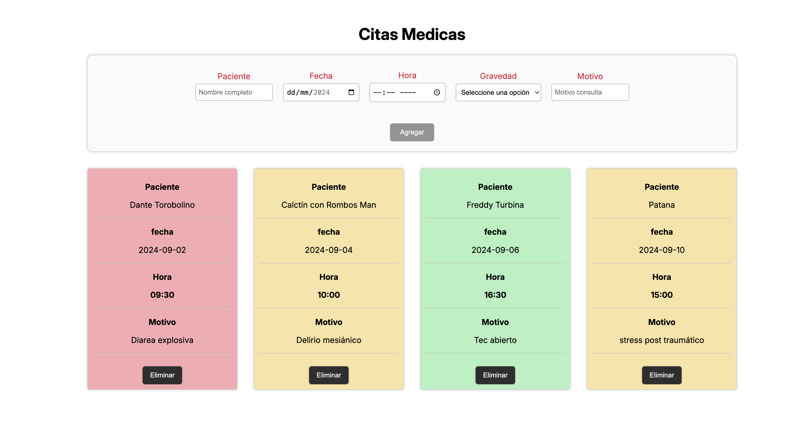

# Desafio Eventos-Renderizacion

Aplicar conocimientos del manejo de eventos y reutilización de
componentes Vue Js, en la creación de un pequeño administrador de citas médicas.
El sistema debe permitir la creación de card de cita de cada paciente y su eliminación.
Cada card toma el color de la gravedad con la que el paciente es ingresado (baja, media y alta gravedad).

---

---

### Requisitos

- **VueJs**
- **Google Fonts**

---

### Autores

- **Desarolladora:[Paloma Rivera](https://github.com/**SingularPigeon)\*\*
- **Diseño: [Bootcamp Desafío Latam](desafiolatam.com)**
